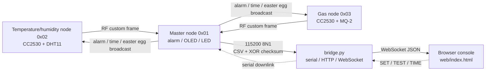
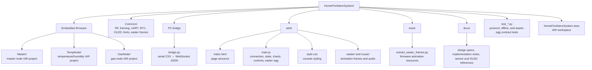

# Home Fire Alarm System

[简体中文](README.md) | [English](README.en.md)

A three-node wireless home fire monitoring system built on TI CC2530. The system combines a master node, a temperature/humidity node, and a hazardous-gas node into an independent RF sensor network. End nodes collect measurements, the master node makes the alarm decision and broadcasts the state, and a PC bridge exposes the data to a browser console.

The system works locally on the OLED displays as well as in the browser. The web console shows live readings, recent charts, node status, and controls. When an alarm is active, the master node, both end nodes, their LEDs, and the web interface respond together. A button on the master node also starts a synchronized three-device animation mode.

## At A Glance

### Web Console


The console presents the online state of all three nodes, temperature, humidity, gas ADC data, live charts, alarm state, and threshold controls. When the bridge is unavailable, the browser enters a local demo mode and returns to real data after reconnecting.

### Three-node Hardware

<table>
  <tr>
    <td align="center"><br><sub>Master node: coordination, alarm decision, and serial uplink</sub></td>
    <td align="center"><br><sub>Temperature/humidity node: DHT11 sampling</sub></td>
    <td align="center"><br><sub>Gas node: MQ-2 sampling</sub></td>
  </tr>
</table>

### Bridge Service and Easter Egg Mode

<table>
  <tr>
    <td align="center"><br><sub>Serial CSV and WebSocket bridge logs</sub></td>
    <td align="center"><br><sub>Web animation overlay</sub></td>
    <td align="center"><br><sub>Animation playing on three OLEDs</sub></td>
  </tr>
</table>

## System Architecture



### Data Flow

1. The temperature/humidity node and gas node sample and report approximately every two seconds.
2. The master node filters frames by the destination ID, stores the latest readings, and handles alarm thresholds, hysteresis, offline detection, and sequence-based packet-loss counting.
3. The master sends XOR-checked CSV lines over USB serial; `bridge.py` validates them and converts them to JSON.
4. The browser receives WebSocket messages and updates node cards, values, charts, and alarm UI.
5. Threshold, simulated-alarm, and time-sync commands travel back through the bridge to the master, which broadcasts the relevant state to the end nodes.

The master firmware is the authority for alarm decisions. The browser is responsible for visualization, control, and demonstration, not for replacing the embedded alarm logic.

## Repository Structure

The diagram below shows the main responsibility boundaries. The three firmware projects share `Common/`, while the PC service connects the embedded network to the browser console.



### Main Directories and Files

| Path | Responsibility |
|---|---|
| `Master/` | Data aggregation, threshold alarms, offline detection, OLED/LED control, serial uplink, and RF broadcasts |
| `TempNode/` | Reads DHT11 and reports temperature/humidity on a schedule |
| `GasNode/` | Reads MQ-2 analog and digital outputs and reports them on a schedule |
| `Common/` | Shared RF, framing, UART, timer, RTC, OLED, font, and easter-egg frame modules |
| `bridge.py` | 115200 8N1 serial handling, HTTP static hosting, and WebSocket forwarding |
| `web/` | Browser console, Canvas charts, demo mode, and easter-egg resources |
| `tools/` | Converts animation assets into firmware-readable C arrays |
| `docs/` | Design documents, implementation notes, sensor references, and showcase images |
| `test_*.py` | Bridge protocol, offline detection, and easter-egg resource/firmware contract tests |

## Features

- **Three-node RF network**: master `0x01`, temperature/humidity `0x02`, and gas `0x03`, using channel 11 and a custom `0xAA 0xBB ... XOR` frame.
- **Temperature and humidity sampling**: DHT11 readings are reported approximately every two seconds with a sequence number.
- **Gas sampling**: MQ-2 analog averages and digital state are reported after the firmware warm-up countdown.
- **Centralized alarm logic**: default thresholds are 45 °C and gas ADC 600, with hysteresis-based clearing and web updates.
- **Synchronized alarm response**: all OLEDs show a flashing “FIRE ALARM” state, LEDs flash, and the web console displays an alarm banner.
- **Connectivity state**: a node is marked offline after approximately 10 seconds without data; the master counts sequence gaps and the bridge parses loss messages.
- **Web console**: live readings, the latest 60 samples, threshold updates, simulated alarms, simulated-alarm clearing, and automatic reconnect.
- **Time synchronization**: the browser sends PC time after connecting, and the master periodically broadcasts time information to both end nodes.
- **Synchronized easter egg**: pressing master-node P0.1 starts 64×64 OLED animation, 128×64 web animation, and web audio; pressing it again restores the monitoring or alarm view.

## Hardware

| Device | Qty. | Purpose |
|---|---:|---|
| ZB2530 board with CC2530 | 3 | Master, temperature/humidity, and gas nodes |
| SSD1306 OLED, 4-wire software SPI | 3 | Local readings and alarm messages |
| DHT11 | 1 | Temperature/humidity sensor |
| MQ-2 module | 1 | Gas sensor |
| USB cable | 1 | Connects the master node to the PC |

Main pins: OLED uses `SCL=P1.2`, `SDA=P1.3`, `RST=P1.7`, and `DC=P0.0`; DHT11 data is on `P0.7`; MQ-2 AO is on `P0.6/AIN6` and DO on `P0.5`; master-node P0.1 is the easter-egg button.

> If the MQ-2 module is powered at 5 V, measure its AO output first. Add a voltage divider between AO and `P0.6` if the output can exceed the CC2530's 3.3 V tolerance.

## Build and Run

### Firmware

The firmware projects use IAR Embedded Workbench for 8051 and target `CC2530F256`.

1. Open `HomeFireAlarmSystem.eww` in IAR.
2. Select `Master`, `TempNode`, and `GasNode` in turn and run **Project → Rebuild All**.
3. Connect the corresponding board and run **Download and Debug**.
4. Verify that each board has the correct project before connecting the master to the PC.

### PC Bridge

Use Python 3.11 or newer with `pyserial` and `websockets`:

```bash
python3.11 -m pip install pyserial websockets
python3.11 bridge.py /dev/tty.usbserial-XXXX
```

Windows example:

```bat
Python311\python.exe -m pip install pyserial websockets
Python311\python.exe bridge.py COM3
```

The bridge exposes:

- Web console: <http://localhost:8080>
- WebSocket: `ws://localhost:8081`

Without a serial-port argument, `bridge.py` prints usage and the available ports. A local `Python311/` directory may exist for development, but it is not tracked by Git and is not required.

### Demonstration

1. Warm up the MQ-2 first; for a new sensor, follow its documentation for a longer stabilization period.
2. Start `bridge.py` and open <http://localhost:8080>.
3. Watch the three nodes come online and observe readings and charts update.
4. Change the temperature or gas threshold and click the threshold-update control.
5. Click the simulated-alarm control to verify the full synchronized response without changing the sensor environment.
6. Disconnect an end node and observe it become offline after about 10 seconds; reconnect it and verify recovery.
7. Press master-node P0.1 to watch the synchronized easter-egg animation.

## Implementation Boundaries

- The current web alarm effect is implemented with CSS, state styling, and the animation overlay; `web/three.min.js` is not a required dependency of the current page.
- `bridge.py` parses packet-loss messages, but the current browser UI does not render a dedicated packet-loss panel.
- RF hardware filtering is disabled; firmware checks the `dst` field in the custom frame in software.
- Alarm thresholds, offline decisions, and broadcast state come from the master firmware.

## Encoding Note

The embedded C sources use the GBK encoding expected by the IAR project. Open them as GBK/GB2312 in an external editor and do not overwrite them as UTF-8, or Chinese comments may become corrupted. Python and web files use UTF-8.
