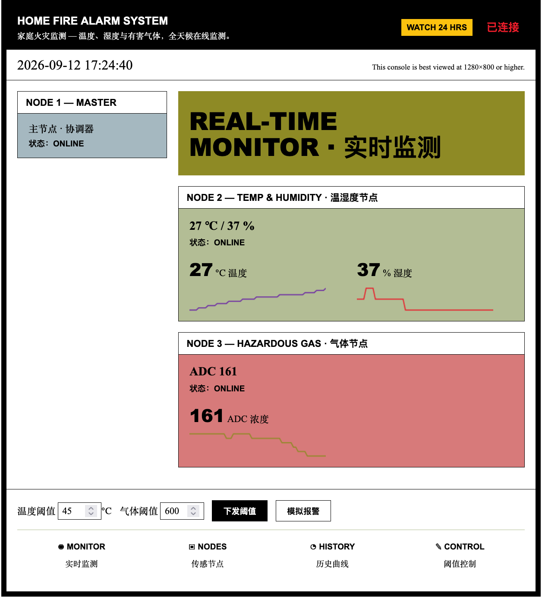
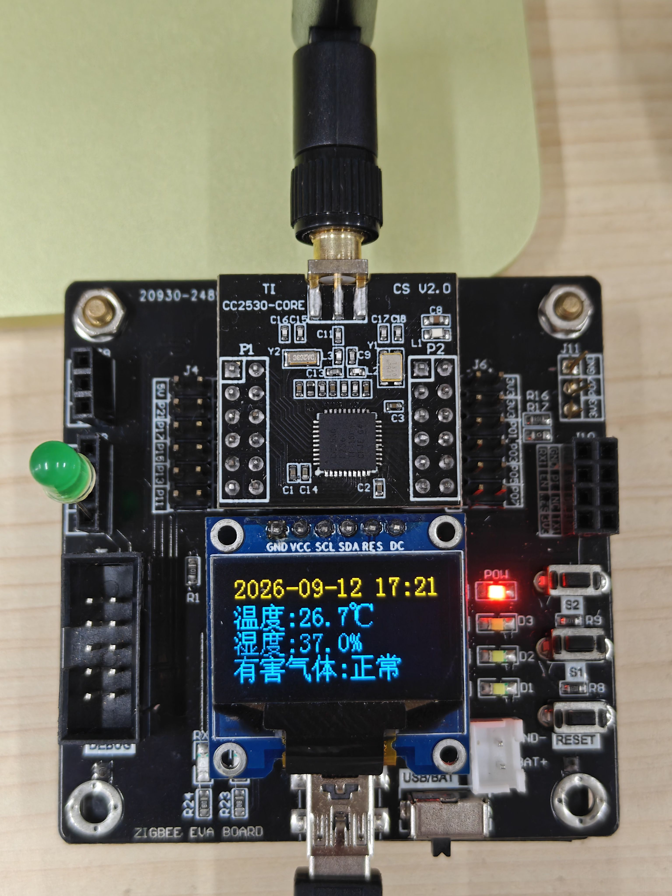
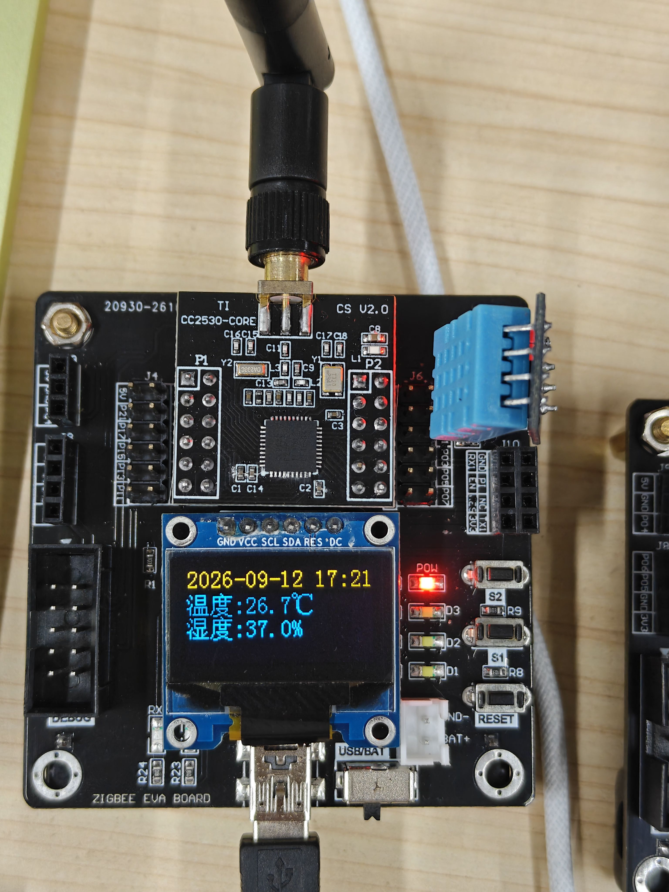
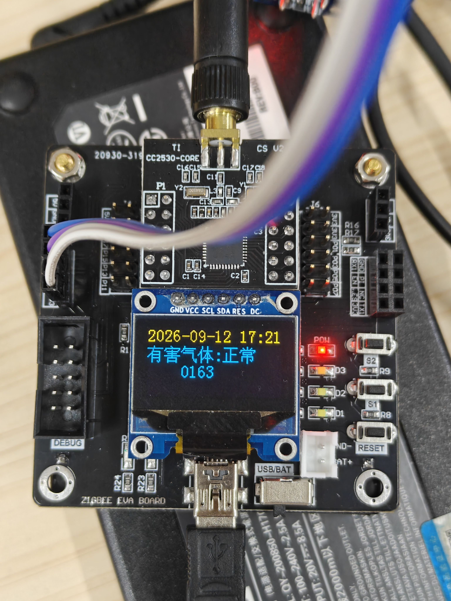
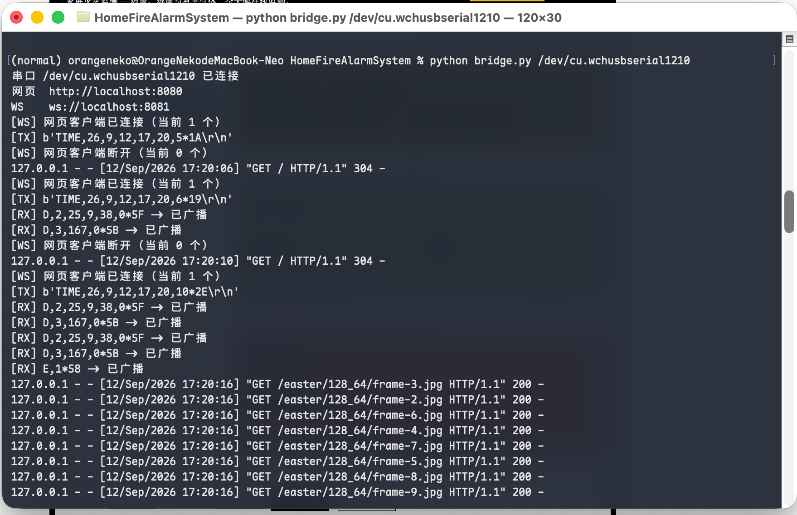
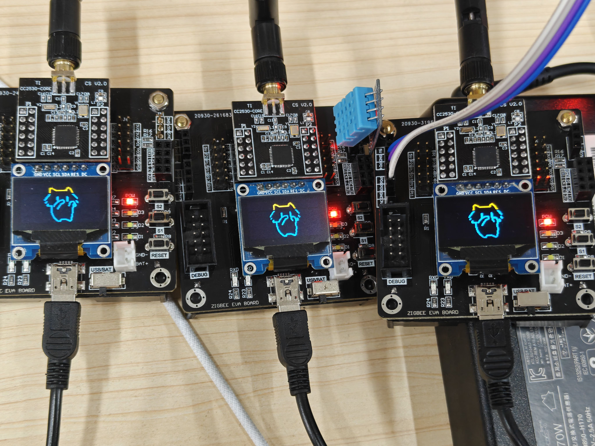
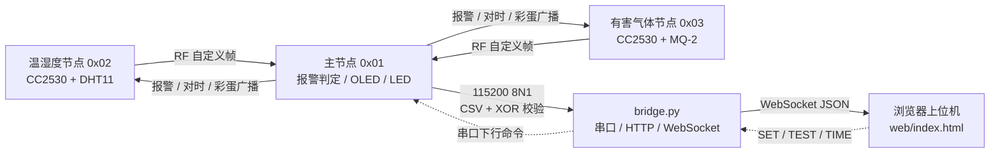
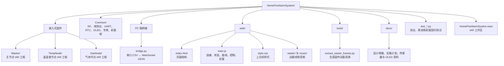

# 家庭火灾报警系统

[](https://deepwiki.com/OrangeNekoo/CC2530_HomeFireAlarmSystem)

[简体中文] | [English](README.en.md)

基于 TI CC2530 的三节点无线家庭火灾监测系统。系统将主节点、温湿度节点和有害气体节点组成一个独立的 RF 传感网络：终端节点负责采集数据，主节点负责集中判定报警并广播状态，PC 端通过串口桥接服务将数据送入浏览器上位机。

系统既能在节点 OLED 上本地运行，也能在网页中查看实时数据、历史曲线和节点状态。发生报警时，主节点、两个终端、网页界面和指示灯同步响应；主节点按键还可以触发三端同步动画模式。

## 效果速览

### 网页上位机



网页同时展示三个节点的在线状态、温湿度、气体 ADC 数据、实时曲线、报警状态和阈值控制。浏览器没有连接桥接服务时会进入本地演示模式，重新连接后恢复真实数据。

### 三节点硬件联动

<table>
  <tr>
    <td align="center"><br><sub>主节点：协调、判警与串口上报</sub></td>
    <td align="center"><br><sub>温湿度节点：DHT11 采集</sub></td>
    <td align="center"><br><sub>气体节点：MQ-2 采集</sub></td>
  </tr>
</table>

### 桥接服务与彩蛋模式

<table>
  <tr>
    <td align="center"><br><sub>串口 CSV 与 WebSocket 桥接日志</sub></td>
    <td align="center"><br><sub>网页彩蛋动画覆盖层</sub></td>
    <td align="center"><br><sub>三块 OLED 同步播放动画</sub></td>
  </tr>
</table>

## 系统架构



### 数据流

1. 温湿度节点和气体节点约每 2 秒采集并通过 RF 上报。
2. 主节点按帧内目标 ID 过滤数据，缓存最近读数，并执行报警、回差、离线和序号丢包统计。
3. 主节点通过 USB 串口发送带 XOR 校验的 CSV 文本；`bridge.py` 校验后转换成 JSON。
4. 浏览器通过 WebSocket 更新节点卡片、数值、曲线和报警界面。
5. 网页下发的阈值、模拟报警和对时命令沿相反方向回到主节点，再由主节点广播给终端。

报警判定以主节点固件为准，网页负责展示、控制和演示，不在浏览器端替代硬件判警逻辑。

## 仓库结构

下面的图对应仓库中的主要职责边界；三个固件工程共享 `Common/`，PC 端服务连接嵌入式网络与网页上位机。



### 主要目录与文件

| 路径 | 作用 |
|---|---|
| `Master/` | 主节点：数据汇聚、阈值判警、离线检测、OLED/LED 控制、串口上报和 RF 广播 |
| `TempNode/` | 温湿度节点：读取 DHT11 并定时上报 |
| `GasNode/` | 气体节点：读取 MQ-2 模拟量和数字量，并定时上报 |
| `Common/` | 三个固件共享的 RF、帧编解码、UART、Timer、RTC、OLED、字库和彩蛋帧模块 |
| `bridge.py` | 115200 8N1 串口、HTTP 静态文件服务和 WebSocket 转发 |
| `web/` | 浏览器上位机、Canvas 曲线、演示模式和彩蛋播放资源 |
| `tools/` | 将动画资源转换为固件可用的 C 数组 |
| `docs/` | 系统设计、实现记录、传感器资料和展示图片 |
| `test_*.py` | 桥接协议、离线检测和彩蛋资源/固件契约测试 |

## 功能特性

- **三节点 RF 网络**：节点 ID 为主节点 `0x01`、温湿度节点 `0x02`、气体节点 `0x03`，使用信道 11 和自定义 `0xAA 0xBB ... XOR` 帧。
- **温湿度采集**：温湿度节点使用 DHT11，约每 2 秒发送一次温度、湿度和序号。
- **气体采集**：气体节点使用 MQ-2，发送 ADC 平均值和数字量状态；上电后先进行固件预热倒计时。
- **集中式报警**：默认温度阈值为 45 ℃、气体 ADC 阈值为 600，支持回差解除和网页修改。
- **三端联动**：报警时主节点和终端 OLED 显示“火灾警报”并闪烁，主节点及终端 LED 同步动作，网页显示报警横幅。
- **可靠性状态**：约 10 秒未收到终端数据即标记离线；主节点根据序号跳变统计丢包，桥接层可解析丢包消息。
- **网页控制台**：实时数据、最近 60 个采样点曲线、阈值下发、模拟报警、解除模拟报警和自动重连。
- **网络对时**：网页连接桥接服务后发送 PC 时间，主节点也会周期性广播对时信息给两个终端。
- **同步彩蛋**：主节点 P0.1 按键触发三块 OLED 的 64×64 动画、网页 128×64 动画和网页音乐；再次按下后恢复监控或报警页面。

## 硬件组成

| 器件 | 数量 | 用途 |
|---|---:|---|
| ZB2530 开发板（CC2530） | 3 | 主节点、温湿度节点、气体节点 |
| SSD1306 OLED（4 线软件 SPI） | 3 | 本地数据显示与报警提示 |
| DHT11 | 1 | 温湿度节点传感器 |
| MQ-2 模块 | 1 | 气体节点传感器 |
| USB 线 | 1 | 主节点连接 PC |

主要引脚：OLED 使用 `SCL=P1.2`、`SDA=P1.3`、`RST=P1.7`、`DC=P0.0`；DHT11 数据线为温湿度节点 `P0.7`；MQ-2 的 AO 接气体节点 `P0.6/AIN6`，DO 接 `P0.5`；主节点 P0.1 为彩蛋按键。

> MQ-2 模块若使用 5V 供电，请先测量 AO 输出；若超过 CC2530 的 3.3V 耐压范围，需要在 AO 与 `P0.6` 之间增加分压。

## 构建与运行

### 固件

固件工程使用 IAR Embedded Workbench for 8051，目标器件为 `CC2530F256`。

1. 在 IAR 中打开 `HomeFireAlarmSystem.eww`。
2. 分别选择 `Master`、`TempNode`、`GasNode` 工程并执行 **Project → Rebuild All**。
3. 将对应开发板连接到调试器，执行 **Download and Debug**。
4. 确认三块板分别烧录了正确的工程，主节点再通过 USB 串口连接 PC。

### PC 桥接服务

需要 Python 3.11 或更高版本，以及 `pyserial` 和 `websockets`：

```bash
python3.11 -m pip install pyserial websockets
python3.11 bridge.py /dev/tty.usbserial-XXXX
```

Windows 示例：

```bat
Python311\python.exe -m pip install pyserial websockets
Python311\python.exe bridge.py COM3
```

启动后，桥接服务提供：

- 网页：<http://localhost:8080>
- WebSocket：`ws://localhost:8081`

如果不传串口参数，程序会打印用法和可用串口列表。仓库中的 `Python311/` 仅代表本地可能使用的便携 Python 目录，Git 不跟踪该目录，也不要求必须使用它。

### 网页演示

1. 先让 MQ-2 充分预热；首次使用建议按传感器资料进行更长时间的稳定化。
2. 启动 `bridge.py` 并打开 <http://localhost:8080>。
3. 观察三个节点上线、读数刷新和曲线滚动。
4. 在网页修改温度或气体阈值，点击“下发阈值”验证主节点广播。
5. 点击“模拟报警”验证三端联动，无需改变传感器环境。
6. 断开任一终端，约 10 秒后观察离线状态；重新上电后确认自动恢复。
7. 按下主节点 P0.1，观察三块 OLED 和网页同步播放彩蛋动画。

## 实现边界

- 当前网页的报警动效主要由 CSS、状态样式和动画覆盖层完成；仓库中的 `web/three.min.js` 不是当前页面的必需依赖。
- `bridge.py` 会解析主节点发送的丢包消息，但当前网页不单独绘制丢包率面板。
- RF 硬件过滤关闭，目标地址由固件解析自定义帧中的 `dst` 字段后软件判断。
- 报警阈值、离线判断和广播状态均以主节点固件为最终来源。

## 编码说明

嵌入式 C 源文件沿用 IAR 工程的 GBK 编码；用外部编辑器查看或修改时请选择 GBK/GB2312，避免以 UTF-8 覆盖导致中文注释乱码。Python 和网页文件使用 UTF-8。
